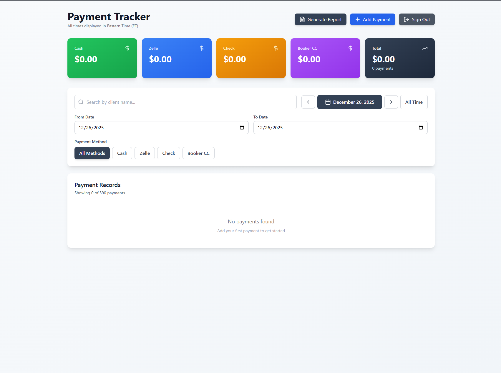
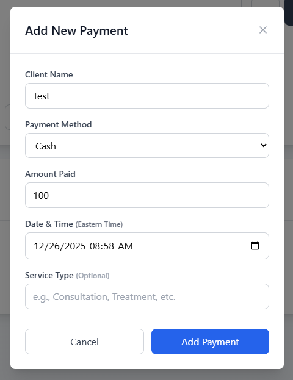
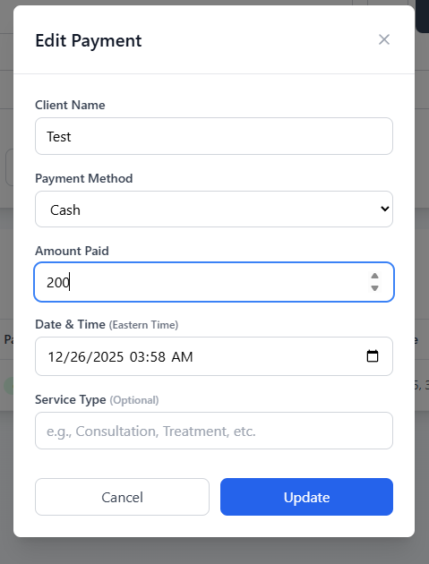

# Payment Tracker - Project Documentation

## Overview
Payment Tracker is a full-stack web application for tracking and managing non-card payment transactions. Built with React, TypeScript, and Supabase, it provides a professional interface for recording payments, filtering data, and generating reports.

---

## Table of Contents
1. [System Requirements](#system-requirements)
2. [Dependencies](#dependencies)
3. [Installation & Setup](#installation--setup)
4. [Architecture Overview](#architecture-overview)
5. [Database Schema](#database-schema)
6. [Features](#features)
7. [Component Documentation](#component-documentation)
8. [Edge Functions](#edge-functions)
9. [Configuration](#configuration)
10. [Screenshots](#screenshots)   

---

## System Requirements

### Prerequisites
- **Node.js**: Version 16.x or higher
- **npm**: Version 8.x or higher (comes with Node.js)
- **Modern Web Browser**: Chrome, Firefox, Safari, or Edge (latest versions)
- **Code Editor**: VS Code, WebStorm, or similar (optional but recommended)

---

## Dependencies

### Production Dependencies
These are required for the application to run:

```json
{
  "@supabase/supabase-js": "^2.57.4",    // Supabase client library for database operations
  "lucide-react": "^0.344.0",            // Icon library for UI elements
  "react": "^18.3.1",                    // React framework
  "react-dom": "^18.3.1"                 // React DOM rendering
}
```

### Development Dependencies
These are required for development and building:

```json
{
  "@eslint/js": "^9.9.1",                      // ESLint core
  "@types/react": "^18.3.5",                   // TypeScript types for React
  "@types/react-dom": "^18.3.0",               // TypeScript types for React DOM
  "@vitejs/plugin-react": "^4.3.1",            // Vite plugin for React
  "autoprefixer": "^10.4.18",                  // PostCSS plugin for CSS prefixes
  "eslint": "^9.9.1",                          // Linting tool
  "eslint-plugin-react-hooks": "^5.1.0-rc.0",  // ESLint rules for React Hooks
  "eslint-plugin-react-refresh": "^0.4.11",    // ESLint rules for Fast Refresh
  "globals": "^15.9.0",                        // Global variables for ESLint
  "postcss": "^8.4.35",                        // CSS transformation tool
  "tailwindcss": "^3.4.1",                     // Utility-first CSS framework
  "typescript": "^5.5.3",                      // TypeScript compiler
  "typescript-eslint": "^8.3.0",               // TypeScript ESLint plugin
  "vite": "^5.4.2"                             // Build tool and dev server
}
```

---

## Installation & Setup

### Step 1: Clone or Download the Project
```bash
# If using Git
git clone <repository-url>
cd payment-tracker

# Or download and extract the project folder
```

### Step 2: Install Dependencies
```bash
npm install
```

This command will install all required dependencies from `package.json`.

### Step 3: Environment Configuration
Create a `.env` file in the project root (if not already present):

```env
VITE_SUPABASE_URL=your_supabase_project_url
VITE_SUPABASE_ANON_KEY=your_supabase_anon_key
```

**Note**: The current `.env` file already contains the Supabase credentials for this project.

### Step 4: Database Setup
The database is already configured with the following tables:
- `payments` - Main payment records table

Migrations are located in `supabase/migrations/` and have already been applied.

### Step 5: Run the Application

#### Development Mode
```bash
npm run dev
```
Access the application at `http://localhost:5173`

#### Production Build
```bash
npm run build
npm run preview
```

#### Other Commands
```bash
npm run lint        # Run ESLint to check code quality
npm run typecheck   # Run TypeScript type checking
```

---

## Architecture Overview

### Technology Stack
- **Frontend Framework**: React 18 with TypeScript
- **Build Tool**: Vite (fast, modern build tool)
- **Styling**: Tailwind CSS (utility-first CSS framework)
- **Database**: Supabase (PostgreSQL-based backend)
- **Icons**: Lucide React
- **State Management**: React Hooks (useState, useEffect, useMemo)

### Project Structure
```
project/
├── src/
│   ├── components/
│   │   ├── PaymentForm.tsx          # Modal form for add/edit payments
│   │   ├── PaymentsTable.tsx        # Table display of payment records
│   │   ├── SearchFilter.tsx         # Search and filtering UI
│   │   └── SummaryCards.tsx         # Financial summary cards
│   ├── lib/
│   │   └── supabase.ts              # Supabase client configuration
│   ├── App.tsx                      # Main application component
│   ├── main.tsx                     # Application entry point
│   └── index.css                    # Global styles
├── supabase/
│   ├── migrations/                  # Database migration files
│   └── functions/                   # Supabase Edge Functions
├── public/                          # Static assets
├── .env                             # Environment variables
├── package.json                     # Project dependencies
├── tsconfig.json                    # TypeScript configuration
├── tailwind.config.js               # Tailwind CSS configuration
└── vite.config.ts                   # Vite configuration
```

---

## Database Schema

### Payments Table
```sql
CREATE TABLE payments (
  id uuid PRIMARY KEY DEFAULT gen_random_uuid(),
  client_name text NOT NULL,
  payment_method text NOT NULL CHECK (payment_method IN ('Cash', 'Zelle', 'Check')),
  amount_paid numeric NOT NULL,
  timestamp timestamptz NOT NULL,
  service_type text,
  created_at timestamptz DEFAULT now(),
  updated_at timestamptz DEFAULT now()
);
```

#### Fields:
- **id**: Unique identifier (UUID, auto-generated)
- **client_name**: Name of the client making the payment
- **payment_method**: Payment type (Cash, Zelle, or Check)
- **amount_paid**: Payment amount in USD
- **timestamp**: Date and time of the payment
- **service_type**: Optional categorization of the service
- **created_at**: Record creation timestamp
- **updated_at**: Last update timestamp

#### Row Level Security (RLS)
RLS is enabled on the payments table to ensure data security. Policies control access based on authentication state.

---

## Features

### 1. Payment Management
- **Add Payments**: Create new payment records with all required details
- **Edit Payments**: Modify existing payment records
- **Delete Payments**: Remove payment records with confirmation
- **Real-time Updates**: Immediate reflection of changes in the UI

### 2. Advanced Filtering
- **Search**: Filter payments by client name (case-insensitive)
- **Date Range**: Filter by specific date ranges
- **Date Navigation**: Navigate day-by-day with previous/next buttons
- **Quick Filters**: Jump to today or view all-time records
- **Payment Method**: Filter by Cash, Zelle, Check, or All Methods

### 3. Financial Summaries
- **Total Amount**: Overall sum of all filtered payments
- **Method Breakdown**: Separate totals for Cash, Zelle, and Check
- **Payment Count**: Number of transactions in current view
- **Color-Coded Cards**: Visual distinction between payment methods

### 4. Report Generation
- **Daily Reports**: Generate HTML reports for specific dates
- **Downloadable**: Reports saved as HTML files for printing/archiving
- **Formatted Output**: Professional layout with summary data

### 5. User Interface
- **Responsive Design**: Works on desktop, tablet, and mobile devices
- **Professional Styling**: Clean, modern interface with Tailwind CSS
- **Loading States**: Visual feedback during data operations
- **Empty States**: Helpful messages when no data is present
- **Smooth Transitions**: Polished animations and hover effects

---

## Component Documentation

### App.tsx
**Purpose**: Main application component that orchestrates all features

**Key Responsibilities**:
- Manages application state (payments, filters, UI states)
- Handles CRUD operations (Create, Read, Update, Delete)
- Implements payment filtering logic with timezone handling
- Manages report generation
- Coordinates component interactions

**State Management**:
- `payments`: Array of all payment records
- `isFormOpen`: Controls add payment modal visibility
- `editingPayment`: Stores payment being edited
- `isLoading`: Loading state for initial data fetch
- `searchTerm`: Client name search filter
- `dateFrom/dateTo`: Date range filters
- `paymentMethod`: Payment method filter

**Key Functions**:
- `loadPayments()`: Fetches all payments from database
- `handleAddPayment()`: Creates new payment record
- `handleUpdatePayment()`: Updates existing payment
- `handleDeletePayment()`: Removes payment record
- `handleGenerateReport()`: Generates downloadable reports
- `filteredPayments`: Memoized computed property for filtered results

---

### PaymentForm.tsx
**Purpose**: Modal form component for adding and editing payments

**Features**:
- Full-screen overlay modal design
- Form validation (required fields)
- Handles both create and edit modes
- Auto-populates data when editing
- Prevents submission during save operation

**Form Fields**:
- Client Name (required, text input)
- Payment Method (required, dropdown: Cash/Zelle/Check)
- Amount Paid (required, number input with decimal support)
- Date & Time (required, datetime picker)
- Service Type (optional, text input)

**Props**:
- `onSubmit`: Callback function for form submission
- `onCancel`: Callback function to close modal
- `initialData`: Payment data for edit mode (optional)
- `isEdit`: Boolean flag to indicate edit mode

---

### PaymentsTable.tsx
**Purpose**: Displays payment records in a responsive table format

**Features**:
- Sortable columns
- Color-coded payment method badges
- Edit and delete action buttons
- Empty state handling
- Responsive overflow scrolling

**Utility Functions**:
- `formatDate()`: Formats timestamps as "Oct 19, 2025, 12:08 AM"
- `formatCurrency()`: Formats numbers as USD currency "$100.00"
- `getMethodColor()`: Returns Tailwind classes for method badges

**Columns**:
1. Client Name
2. Service Type (shows dash if empty)
3. Payment Method (colored badge)
4. Amount (right-aligned, bold)
5. Date & Time
6. Actions (edit/delete buttons)

---

### SearchFilter.tsx
**Purpose**: Advanced filtering interface for payment data

**Features**:
- Text search with icon
- Visual date navigator with formatted display
- Previous/Next day navigation arrows
- Quick access buttons (Today, All Time)
- Date range picker inputs
- Payment method toggle buttons

**Date Handling**:
- Adds `T12:00:00` to dates to prevent timezone shifts
- Maintains consistent date display across components
- Enables day-by-day navigation
- Supports custom date ranges

**Filter Types**:
1. **Search**: Filters by client name
2. **Date Range**: From/To date pickers
3. **Payment Method**: All/Cash/Zelle/Check buttons

---

### SummaryCards.tsx
**Purpose**: Displays financial summary statistics

**Features**:
- Four gradient-styled cards
- Real-time calculation from filtered data
- Color-coded by payment method
- Displays payment count

**Cards**:
1. **Cash** (Green): Total cash payments
2. **Zelle** (Blue): Total Zelle payments
3. **Check** (Amber): Total check payments
4. **Total** (Slate): Overall total + payment count

**Calculation**:
Uses `Array.reduce()` to accumulate totals by payment method in a single pass through the data.

---

## Edge Functions

### generate-payment-report
**Location**: `supabase/functions/generate-payment-report/`

**Purpose**: Generates formatted HTML reports for specific dates

**Endpoint**: `GET /functions/v1/generate-payment-report?date=YYYY-MM-DD`

**Process**:
1. Receives date parameter from query string
2. Queries database for payments on that date
3. Calculates totals and breakdowns
4. Generates HTML document with inline styles
5. Returns HTML for download

**Authentication**: Requires Supabase anonymous key in Authorization header

**CORS**: Properly configured for cross-origin requests

---

## Configuration

### Environment Variables
Required in `.env` file:
```
VITE_SUPABASE_URL         # Your Supabase project URL
VITE_SUPABASE_ANON_KEY    # Your Supabase anonymous key
```

### Tailwind CSS
Configured in `tailwind.config.js` with:
- Custom color schemes
- Responsive breakpoints
- Plugin configurations

### TypeScript
Strict mode enabled in `tsconfig.json` for type safety:
- Strict null checks
- No implicit any
- Strict function types

### Vite
Configured in `vite.config.ts`:
- React plugin for Fast Refresh
- Port configuration
- Build optimizations

---

## Development Workflow

### Adding New Features
1. Create new components in `src/components/`
2. Add necessary types in component files or `src/lib/`
3. Update `App.tsx` to integrate new features
4. Test thoroughly with TypeScript type checking
5. Build and verify production bundle

### Database Changes
1. Create new migration files in `supabase/migrations/`
2. Follow naming convention: `YYYYMMDDHHMMSS_description.sql`
3. Include comprehensive comments in migration
4. Apply migration through Supabase CLI or MCP tools

### Code Quality
```bash
npm run lint        # Check for linting errors
npm run typecheck   # Verify TypeScript types
npm run build       # Test production build
```

---

## Common Operations

### View Payment Records
1. Launch application
2. Records automatically load and display
3. Use filters to narrow results

### Add a Payment
1. Click "Add Payment" button
2. Fill in all required fields
3. Optionally add service type
4. Click "Add Payment" to save

### Edit a Payment
1. Click edit icon (pencil) on any payment row
2. Modify fields as needed
3. Click "Update" to save changes

### Generate a Report
1. Filter to a specific date using date picker
2. Click "Generate Report" button
3. Report downloads as HTML file
4. Open in browser to view/print

### Filter Payments
1. Use search box for client names
2. Navigate dates with arrows or date pickers
3. Click payment method buttons to filter
4. Click "All Time" to clear date filters

---

## Screenshots

This section provides visual documentation of the Payment Tracker application. Screenshots help illustrate the user interface, key workflows, and overall functionality.

### Dashboard Overview
Displays the main application view with summary cards, filters, and the payments table.


### Add Payment Modal
Shows the modal form used to create a new payment record.


### Edit Payment Flow
Illustrates editing an existing payment record.


### Filtering and Search
Demonstrates searching by client name, date navigation, and payment method filtering.


---

## Troubleshooting

### Build Errors
- Ensure all dependencies are installed: `npm install`
- Check Node.js version: `node --version` (should be 16+)
- Clear node_modules and reinstall: `rm -rf node_modules && npm install`

### Database Connection Issues
- Verify `.env` file contains correct Supabase credentials
- Check Supabase project is active and accessible
- Confirm database migrations have been applied

### TypeScript Errors
- Run type checking: `npm run typecheck`
- Ensure all imports have correct types
- Check for missing type definitions

---

## Performance Considerations

### Optimizations Implemented
- **useMemo**: Filters payments only when dependencies change
- **Component Memoization**: Prevents unnecessary re-renders
- **Date Handling**: Efficient date-only comparisons
- **Database Indexing**: Timestamp column indexed for fast queries

### Best Practices
- Keep payment records archived if dataset grows large
- Use date filters for better performance with large datasets
- Regular database maintenance through Supabase dashboard

---

## Security Notes

### Data Protection
- Row Level Security (RLS) enabled on database tables
- Environment variables never exposed to client
- Anonymous key used (limited permissions)
- CORS properly configured on Edge Functions

### Authentication
Current implementation uses Supabase anonymous access. For production:
- Consider implementing user authentication
- Add user-specific RLS policies
- Implement role-based access control

---

## Future Enhancement Ideas

1. **Export to CSV/Excel**: Download payment data in spreadsheet format
2. **Charts & Analytics**: Visual representation of payment trends
3. **Multi-user Support**: User authentication and permissions
4. **Recurring Payments**: Schedule and track recurring payments
5. **Payment Categories**: Enhanced categorization beyond service type
6. **Email Reports**: Automatic report delivery via email
7. **Mobile App**: Native mobile application
8. **Backup & Restore**: Data backup functionality

---

## Support & Resources

### Documentation
- [React Documentation](https://react.dev/)
- [TypeScript Documentation](https://www.typescriptlang.org/docs/)
- [Supabase Documentation](https://supabase.com/docs)
- [Tailwind CSS Documentation](https://tailwindcss.com/docs)
- [Vite Documentation](https://vitejs.dev/)

### Getting Help
1. Review this documentation thoroughly
2. Check browser console for error messages
3. Verify database connection and migrations
4. Review component comments in source code

---

## License & Credits

This project uses the following open-source libraries:
- React (MIT License)
- TypeScript (Apache 2.0)
- Tailwind CSS (MIT License)
- Supabase (Apache 2.0)
- Lucide Icons (ISC License)
- Vite (MIT License)

---

## Conclusion

Payment Tracker is a production-ready application for managing payment transactions. With its clean architecture, comprehensive documentation, and professional UI, it provides a solid foundation for payment tracking needs. The modular component structure makes it easy to extend and customize for specific requirements.

For questions or issues, review the component comments in the source code - each file is thoroughly documented to explain its purpose and functionality.
